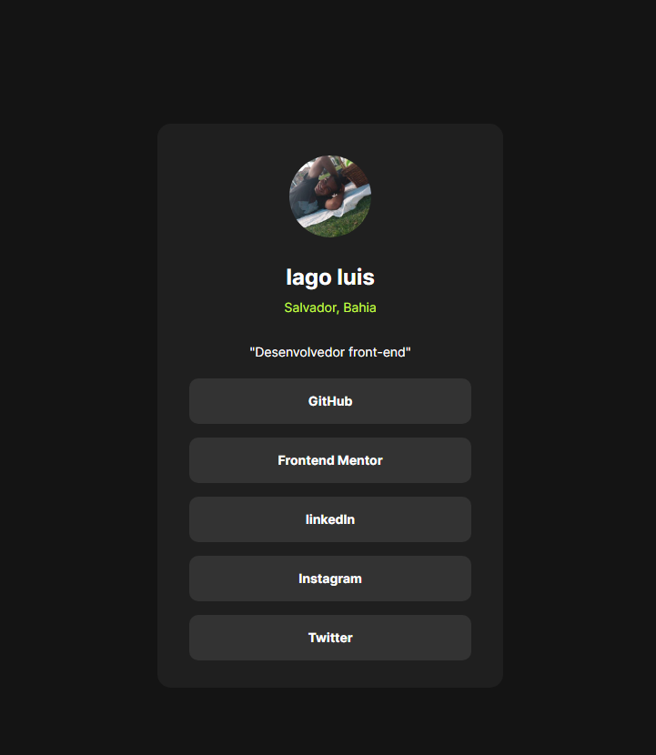

## Visão geral.

### O desafio.

É fazer um perfil de compartilhamento de links socias.

### Captura de tela.

## Meu processo

### Construído com.

- HTML5
- CSS

### O que eu aprendi.

Coloquei o meu conhecimento em pratica para desenvolver o meu apresizado asssim. descobrido aonde tenho que melhora tanto no html como no css.
 
### HTML
Fazer um melhor reflequição para  

Fazer uma reflexão melhor para poder fazer uma melhor estrutura do codigo no inicio. 
### CSS
melhor mas a noção de posicionamento e memória melhor o que faz cada tags.
estou diminuino cada vez mas as idas nas minha anotações

### Desenvolvimento contínuo.

pretendo desenvolver mais no html e no css para então passa a estuda o JS.
fazendo mais desafio no Front-End Mentor.

## Autor
- Site - [Iago LUis].